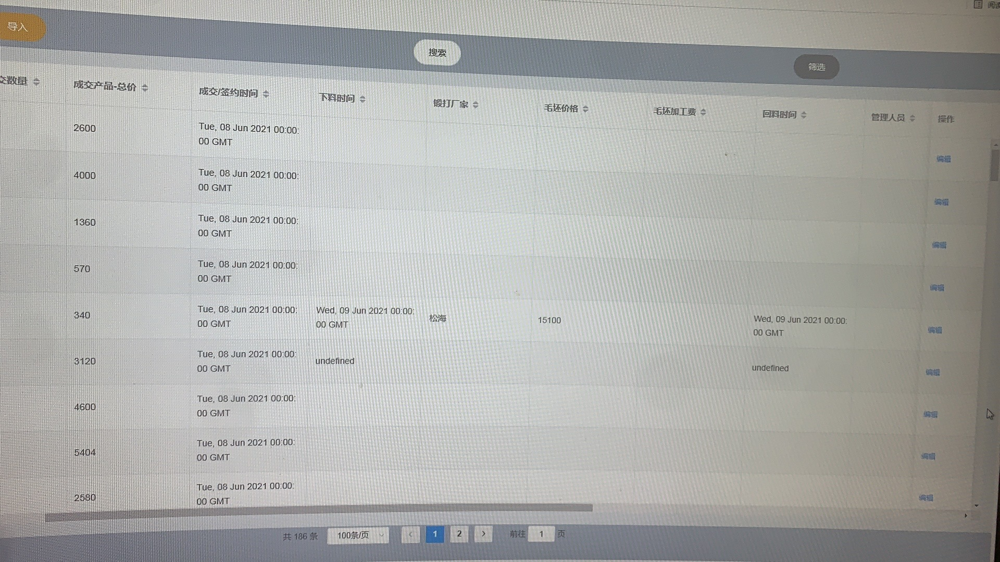
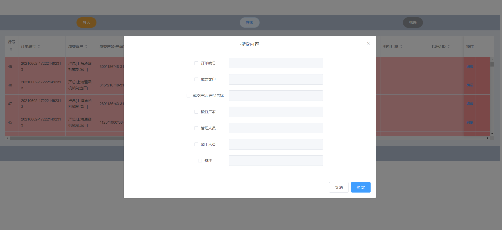
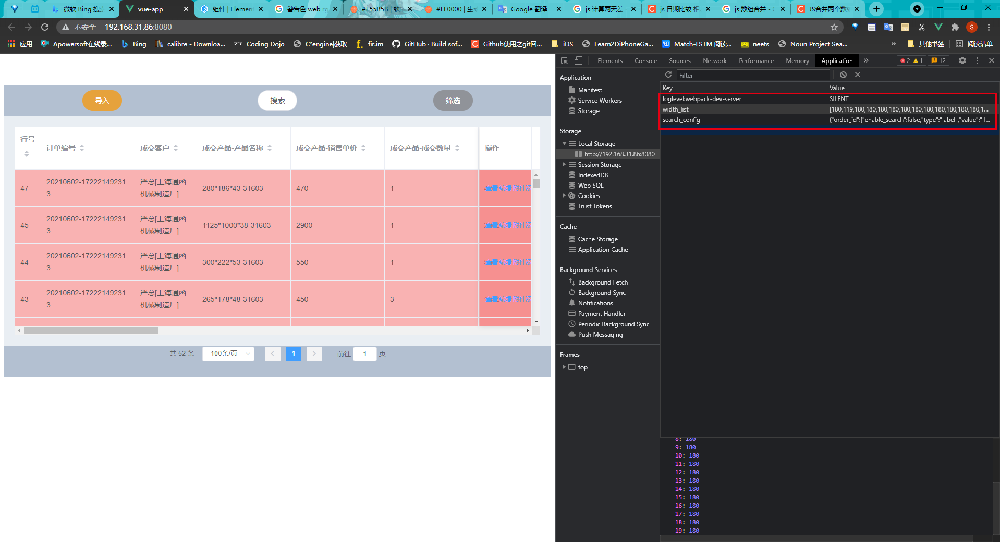
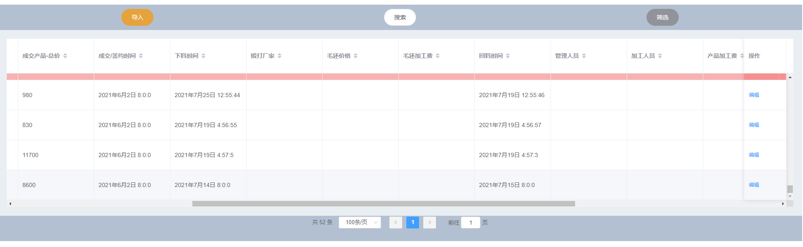
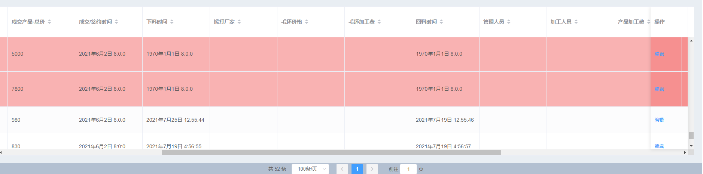

# 迭代 2021/6/22

- [x] 搜索

- [x] 筛选

- [x] 设计排版(保存排版)

- [x] 时间显示英文

  

- [x] 下料时间及回料时间显示NUMBER

  

- [x] 设置一个报警系统

- [ ] 附件

## 搜索

## 设计排版

## 时间显示英文

## 设置一个报警系统

不过必须一页页查看有没有错过的报警数据

## 迭代 2021/7/18

- [ ] 搜索增加时间筛选
- [ ] 附件